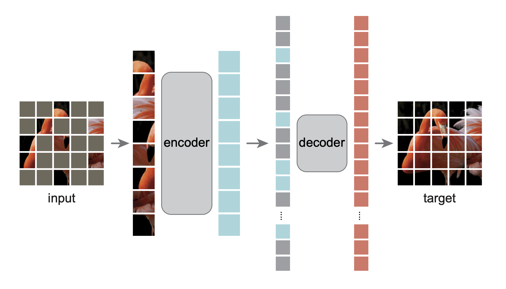

# MAE_from_scratch

## Introduction

Pytorch版本实现的Masked AutoEncoder(仅供学习)

## Preliminary

- **mae-architecture**

## Acknowledgements

- [Masked Autoencoders: A PyTorch Implementation](https://github.com/facebookresearch/mae)
- [Masked Autoencoders Are Scalable Vision Learners](https://arxiv.org/abs/2111.06377)
- [逐行讲解Masked AutoEncoder(MAE)的PyTorch代码](https://www.bilibili.com/video/BV1JS4y1N7XE/?spm_id_from=333.1007.top_right_bar_window_history.content.click&vd_source=634f9cd56b5b0cf10f6976238630bd8d)